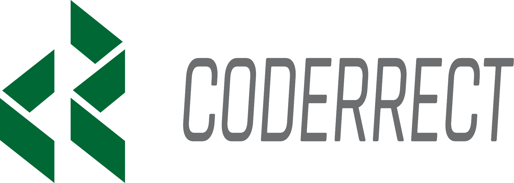
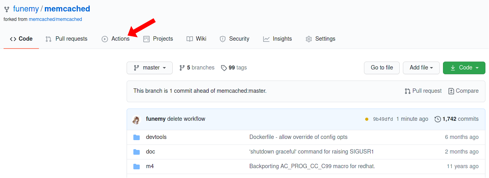
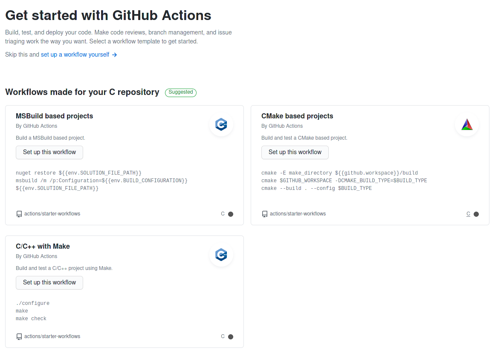
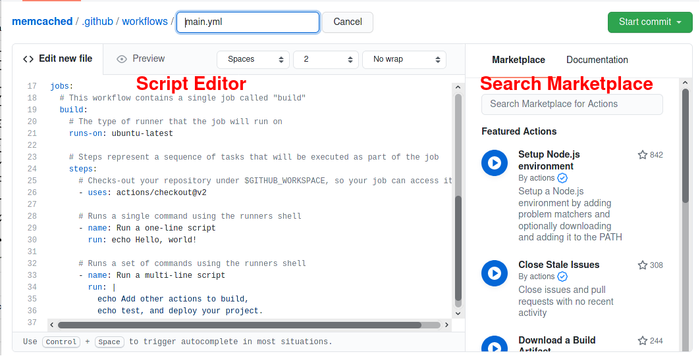
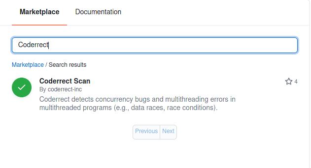
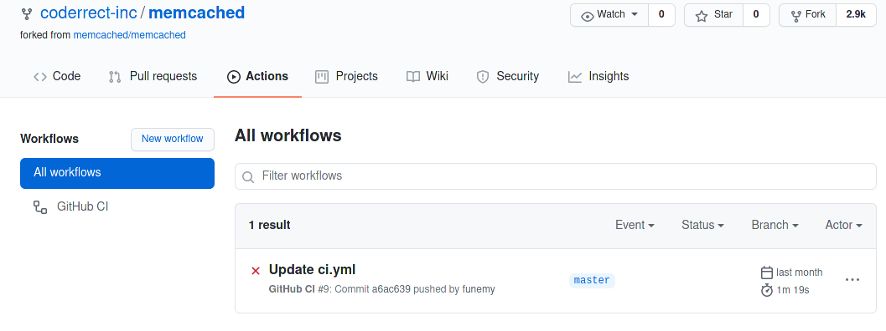
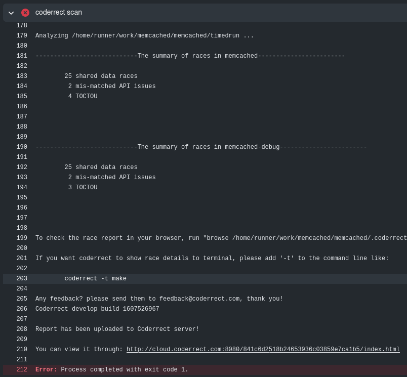

<p align="center">
<a href="https://coderrect.com"></a>
 </p>
<h1 align="center">Coderrect Github Action </h1>
<div align="center">
 <strong>
    GitHub Action for the Coderrect static race detection scanner
 </strong>
</div>
<br/>


## About
The `coderrect-github-action` runs static analysis in a GitHub workflow using [Coderrect](https://coderrect.com) to automatically detect concurrency bugs in your code:
- Coderrect is an efficient and accurate static analysis solution to identify potential concurrency bugs in your multi-threaded software.
- Coderrect supports C/C++/Fortran code and common parallel programming interfaces including OpenMP, pthread, and C++ std::thread.
- Coderrect Github Action supports generating formatted HTML reports and hosting them on Coderrect cloud for users to review.

Documentation and examples are available at: [Coderrect Action Documentation](https://coderrect.com/docs/github-actions/)

More information about Coderrect Scanner is available at: [Coderrect.com](https://coderrect.com)

**Table of Contents**

- [Demo](#demo)
- [Before You Start](#before-you-start)
- [Example Usage](#example-usage)
  - [For CMake projects](#for-cmake-projects)
  - [For Fortran projects](#for-fortran-projects)
  - [For customized analysis](#for-customized-analysis)
- [Customizable Inputs](#inputs)
- [License](#license)

## Demo


## Before You Start

Continuous Integration/Continuous Delivery (CI/CD) is a common practice now for developing software. In CI, typically tests and checks are run against every pull request and code commit to ensure the new code changes do not break anything or introduce new bugs. CI makes it easier to fix bugs quickly and often.

You can create custom CI/CD workflows directly in your GitHub repository with **GitHub Actions**. 

In this tutorial, we take [memcached][memcached] as an example project to demonstrate how to set up GitHub Actions.

To start, you can click the “Action“ tab above your GitHub Repository.



Once you enter the Action tab, GitHub will guide you to create your own CI/CD script by providing different template scripts based on different building system.



Here you can select **“set up a workflow yourself“** to use the basic template.

GitHub will automatically create a YAML file (`main.yml` by default) under **`.github/workflows`** and this is the path which you should put your future scripts under. The left-hand side is the script editor and the right-hand side is the place you can search different existing Action scripts published in GitHub Marketplace.



The default template script looks similar as below, we will explain it in detail:

```
# This is a basic workflow to help you get started with Actions
name: CI

# Controls when the action will run. 
on:
  push:
    branches: [ master ]
  pull_request:
    branches: [ master ]

  # Allows you to run this workflow manually from the Actions tab
  workflow_dispatch:

# Defines the workflow of this action.
jobs:
  # This workflow contains a single job called "build"
  build:
    # The type of runner that the job will run on
    runs-on: ubuntu-latest

    # Steps represent a sequence of tasks that will be executed as part of the job
    steps:
      # Checks-out your repository under $GITHUB_WORKSPACE, so your job can access it
      - uses: actions/checkout@v2

      # Runs a single command using the runners shell
      - name: Run a one-line script
        run: echo Hello, world!

      # Runs a set of commands using the runners shell
      - name: Run a multi-line script
        run: |
          echo Add other actions to build,
          echo test, and deploy your project.
```

The definition of an action consists of two major parts: `on` and `jobs`.

Field `on` defines when this action will be triggered. The default template only triggers the action when there’s a push or pull request made upon the main branch.

For example, if you want the action to be triggered at any event on any branch, you can simply change the script to:

```
on: [push, pull_request]
```

If you only want to trigger actions manually, then you should specify `workflow_dispatch` instead. This will create a button in the Action Tab for you to trigger them manually later. Check out this [blog](https://github.blog/changelog/2020-07-06-github-actions-manual-triggers-with-workflow_dispatch/) on how to manually trigger GitHub Actions.

Field `job` defines the actual workflow of the action. The subfield `build` is a customized job name, and you can change it to something more meaningful, such as `test-build-on-ubuntu`.

`runs-on` specifies the system image on which you want to run your CI/CD tasks.

`steps` specifies the detailed sub-tasks performed in a job. You can compose your CI/CD job using the published Actions from GitHub Marketplace and your own customized scripts.


## Example Usage
Take [memcached][memcached] as an example for integrating Coderrect.
Check [here](https://github.com/coderrect-inc/memcached/blob/master/.github/workflows/ci.yml) for the final script.

[memcached]: https://github.com/coderrect-inc/memcached

In general, integrating Coderrect requires three steps:

```
steps:
# step 1
- uses: actions/checkout@v2
# step 2
- name: Install deps
  run: |
    sudo apt-get update -y
    sudo apt-get install -y libevent-dev libseccomp-dev git libsasl2-dev
- name: Build
  run: |
    gcc --version
    ./autogen.sh
    ./configure --enable-seccomp --enable-tls --enable-sasl --enable-sasl-pwdb
    make -j
# step 3
- name: coderrect scan
  uses: coderrect-inc/coderrect-github-action@main
```

- **Step1**: Check out your GitHub repository, using an action provided by GitHub.

- **Step2**: Installs all dependencies required for building the project (“Install deps”) and does a test build (“Build“). 

Note that including task “Build“ is **not required** for Coderrect to function, but it’s critical to make sure your project can successfully build before applying Coderrect.

- **Step3**: Apply Coderrect to your project. You can search the GitHub Marketplace to obtain the most updated script and all available options.



Once this script is saved, the GitHub Action you just defined will be automatically triggered when you push new commits or merge pull requests. You can review them by entering the “Action“ tab.



To see Coderrect’s race detection report, you can click task “coderrect scan“ to expand its terminal output. Coderrect will output a list of summary for all executables it analyzes and also attach an report link at the end for you to view them in detail.



If you are using a different building system (e.g., CMake) or a different language or compiler, then you need to properly configure Coderrect. Here we provide instructions for some commonly used configurations.

### For CMake projects
You will need to install and setup `cmake` first.
```yaml
- name: download cmake
  run: |
    wget https://cmake.org/files/v3.18/cmake-3.18.2-Linux-x86_64.tar.gz
    tar xf cmake-3.18.2-Linux-x86_64.tar.gz
    mkdir build && cd build
    ../cmake-3.18.2-Linux-x86_64/bin/cmake ..
```
Since we are building the project under the `build` directory instead of the root path.
We will also need to specify the build directory for Coderrect.
```yaml
- name: Coderrect Scan
  uses: coderrect-inc/coderrect-github-action@v1.2
  with:
    buildPath: "build"
```

For more details, take a look at this [cmake project](https://github.com/coderrect-inc/covid-sim) to learn how to integrate Coderrect into more complex projects

### For Fortran projects
You will need to install the fortran compiler first. For example:
```yaml
- name: Install fortran
  run: |
    sudo apt-get update -y
    sudo apt-get install -y gfortran
```
Then it is likely that you need to specify the fortran compiler when you use `make`. If so, you should also pass the full compilation command to Coderrect. (`gcc` is pre-installed in the Github Action environment.)
```yaml
- name: coderrect scan
  uses: coderrect-inc/coderrect-github-action@v1.2
  with:
    buildCommand: "make COMPILER=GNU MPI_COMPILER=gfortran C_MPI_COMPILER=gcc"
```

For more details, take a look at this [Fortran project](https://github.com/coderrect-inc/CloverLeaf_OpenMP) to learn how to integrate Coderrect into more complex projects

### For customized analysis
Coderrect allows you to provide a configuration file to fully customize your analysis.

In order to do so, check our [documentation](https://coderrect.com/documentation/reference/) to see available configurations. Once you write a configuration file (say `coderrect.json`). You can pass it to the scanner as below:
```yaml
- name: coderrect scan
  uses: coderrect-inc/coderrect-github-action@v1.2
  with:
    options: "-analyzeAllBinaries -conf=/path/to/coderrect.json"
```

The path should be **a relative path from your build directory** (e.g., if your build directory is `./build/` and your config file is under the root path, then you should specify the config file as `"-conf=../coderrect.json"`).

## Inputs
Inputs are the set of fields you can configure to customized the behavior of Coderrect Gtihub Action.

- `buildCommand`
  - Default: `"make -j"`
  - Description: The command to build your project. For example, the command to build your whole project might be `make all` instead of `make`.
- `cleanCommand`
  - Default: `"make clean"`
  - Description: The command to clean your previous build. Coderrect needs to capture the building process for analysis, therefore if you have done a test build before applying Coderrect, we need to clean your test build first.
- `buildPath`
  - Default: `"."` (the root path of your project)
  - Description: The relative path for your cmake project's build directory.
- `options`
  - Default: `"-analyzeAllBinaries"`
  - Description: The command line options for Coderrect Scanner. Check the [documentation](https://coderrect.com/documentation/reference/) for all supported options.
- `exit0`
  - Default: false
  - Description: By default, Coderrect will exit with 1 if any race is detected, thus your following CI/CD workflow will be blocked. Set this to true if you want CI/CD to proceed after Coderrect no matter what.

## License
   Copyright 2020 Coderrect Inc.

   Licensed under the Apache License, Version 2.0 (the "License");
   you may not use this file except in compliance with the License.
   You may obtain a copy of the License at

       http://www.apache.org/licenses/LICENSE-2.0

   Unless required by applicable law or agreed to in writing, software
   distributed under the License is distributed on an "AS IS" BASIS,
   WITHOUT WARRANTIES OR CONDITIONS OF ANY KIND, either express or implied.
   See the License for the specific language governing permissions and
   limitations under the License.
